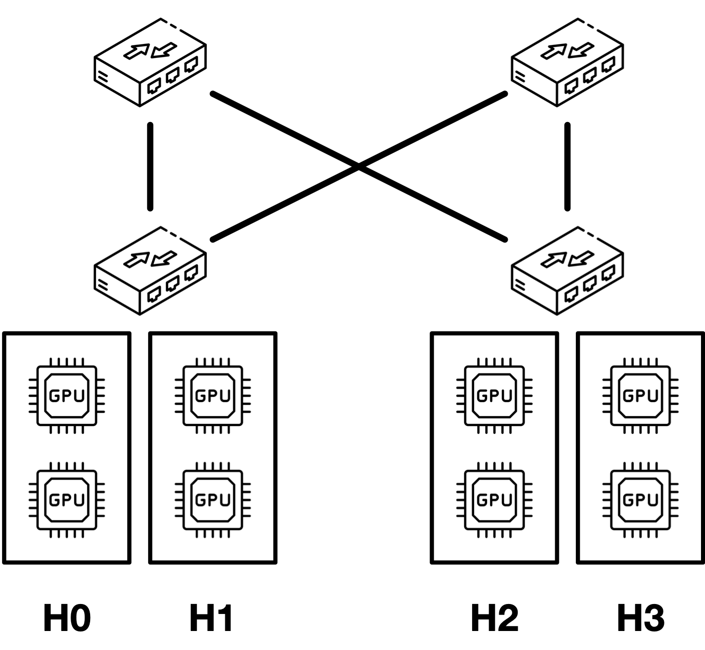

# MCCS Evaluation Setup

## Hardware Setup

As shown in the figure, in our evaluation, we have four nodes in our testbed, each equipped with 2 NVIDIA RTX 3090 GPUs and a 100 Gbps Mellanox ConnectX-5 NIC. Using a single 100 Gbps Mellanox SN2100 switch, we emulate a spine-leaf topology with 2 leaf switches and 2 spine switches through self-wiring. Four nodes are placed under two racks, where each rack corresponds to a leaf switch. The links between the switches are limited to 50 Gbps, while the links between each host and the leaf switches are limited to 100 Gbps. On each host, we use IB traffic class (TC) and rate limit each TC to emulate two 50 Gbps virtual NICs (one per GPU).

## System Environment
- NVIDIA GPU drivers and CUDA must be installed. Our code is tested with CUDA 12.1.
- GDRcopy library must be installed. which can be found here: https://github.com/NVIDIA/gdrcopy
- Mellanox OFED drivers, which can be found here: https://network.nvidia.com/products/infiniband-drivers/linux/mlnx_ofed/
- Rust version `nightly-2023-11-11 `. Follow https://www.rust-lang.org/tools/install to install `rustup`. `rustup` will automatically install this version configured in `rust-toolchain` file. `Cargo.lock` file provides the concrete version we used for each Rust dependency.